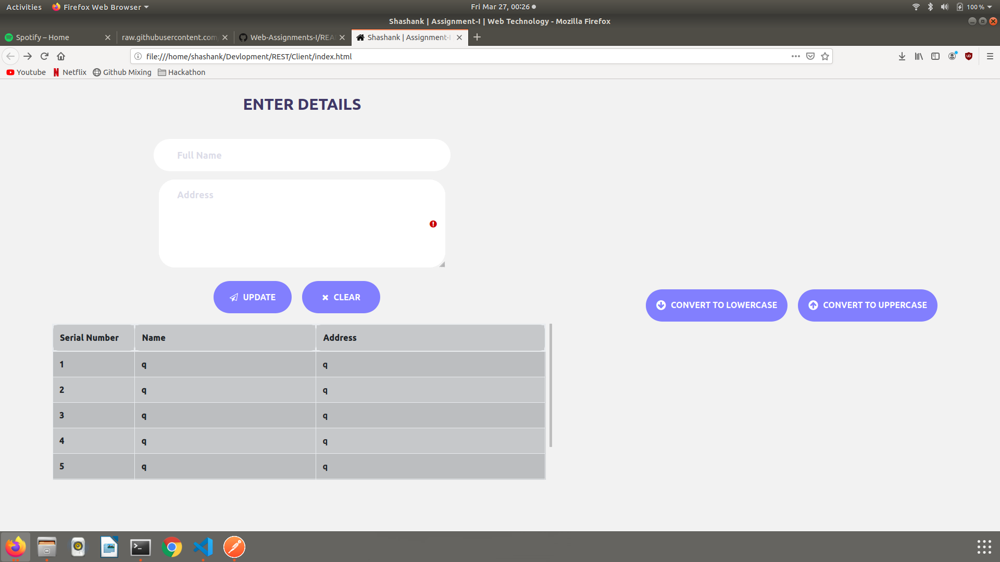

# RESTful API using Node.js and Client Application
## Contents
- A RESTful API which has to endpoints to convert strings to capital letters and small letters
- A client web application which works with the above API

### How to Run
- Get the Project
- git clone https://github.com/Scramjet911/Web-Assignments-I.git

### Run Web Server
- cd Web-Assignments-I/Server
- npm install
- npm start

### Run Web Client
- Open script.js from Web-Assignments-I/Client/js
- Now open index.html from Web-Assignments-I/Client/ in a browser

### Demo

